<!-- README.md is generated from README.Rmd. Please edit that file -->

# modnets

<!-- badges: start -->
<!-- badges: end -->

R package designed to afford exploratory and confirmatory estimation of
3 types of moderated networks:

1.  Cross-sectional moderated networks
    -   Involves nodewise estimation of a GGM with higher-order
        interactions
    -   Can accommodate any combination of continuous and binary
        variables.
    -   Nodewise regressions are fit using either OLS or logistic
        regression, depending on variable types.
2.  Idiographic (temporal) moderated networks
    -   Involves generalized least squares (GLS) estimation of
        multivariate time series model, as well as the
        inverse-covariance structure of the residuals.
    -   Currently only works for continuous variables, although
        exogenous moderators can be binary.
    -   Default estimation is seemingly unrelated regressions (SUR) via
        `systemfit`, but OLS is also available (unconstrained SUR
        estimates are equivalent to OLS estimates).
3.  Multi-level moderated networks
    -   Uses one of two methods for estimation.
    -   One is a two-step multilevel model, where fixed/random effects
        are estimated separately from between-subject effects
    -   The other uses a formal multilevel moderated vector
        autoregressive model with `lmer`
    -   Only works for continuous variables, although exogenous
        moderators can be binary.

Additionally, model selection techniques based on penalized regression
and iterative resampling are implemented alongside a variety of plotting
and data-generating functions.

## Installation

You can install the development version of modnets from
[GitHub](https://github.com/tswanson222/modnets) with:

``` r
# install.packages('devtools')
devtools::install_github('tswanson222/modnets')
```

## Usage

``` r
library(modnets)

data <- na.omit(psychTools::msq[, c('hostile', 'lonely', 'nervous', 'sleepy', 'depressed')])

fit <- fitNetwork(data, moderators = 'depressed')

plot(fit, threshold = TRUE)
```

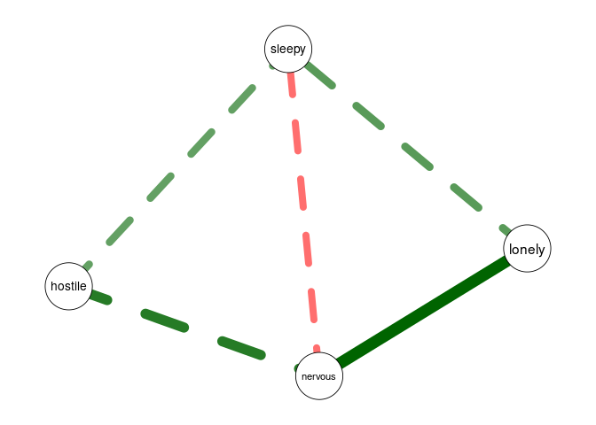

## Package Functions

### Primary functions

-   The primary function used for the first two types of models is:
    `fitNetwork`. There are a variety of arguments and options that can
    be used for, e.g., penalized estimation, model specification, etc.
-   The primary functions used for the third model are: `mlGVAR` and
    `lmerVAR`, depending on which approach you wish to use.

### Model selection

-   For model selection, you can use `varSelect` to employ either
    best-subset selection (via `leaps`), the LASSO, ridge regression, or
    elastic net (via `glmnet`), or the hierarchical LASSO (via
    `glinternet`). These methods support various information criteria as
    well as cross-validation for model selection, and are embedded
    within the `varSelect` function.
-   As a note, all of the model selection procedures in `varSelect`
    operate on a sequential, nodewise basis.
-   Additionally, you can use the `resample` function to use repeated
    subsampling or bootstrapping with the `varSelect` algorithm built
    in.
-   This latter method will take into account the actual model-fit
    values (such as those obtained in the GLS-driven SUR for temporal
    networks)

### Stability & power analyses

-   Currently, these methods are not supported in the multilevel
    setting.
-   For bootstrapping/edge-weight accuracy analysis, you can use the
    `bootNet` function.
-   For case-dropping stability analysis, you can use `bootNet` while
    setting `caseDrop = TRUE`.
-   For power analysis, you can use: `mnetPowerSim` to simulate data
    based on expected network structure(s).

See the package description for an overview of these and other core
functions.

``` r
library(modnets)
?modnets
```

## Examples

### Cross-sectional moderated network

``` r
library(modnets)
# Package is now loaded! 

### ================================================ ###
### ======= SIMULATE MODERATED NETWORK DATA ======== ###
### ================================================ ###
# Can simulate data with no moderators, or with one exogenous moderator
set.seed(123)
x <- simNet(N = 500, p = 5, m = TRUE, m1 = .5, m2 = .2)
#>   |                                                                              |                                                                      |   0%  |                                                                              |                                                                      |   1%  |                                                                              |=                                                                     |   1%  |                                                                              |=                                                                     |   2%  |                                                                              |==                                                                    |   2%  |                                                                              |==                                                                    |   3%  |                                                                              |===                                                                   |   4%  |                                                                              |===                                                                   |   5%  |                                                                              |====                                                                  |   5%  |                                                                              |====                                                                  |   6%  |                                                                              |=====                                                                 |   7%  |                                                                              |=====                                                                 |   8%  |                                                                              |======                                                                |   8%  |                                                                              |======                                                                |   9%  |                                                                              |=======                                                               |   9%  |                                                                              |=======                                                               |  10%  |                                                                              |=======                                                               |  11%  |                                                                              |========                                                              |  11%  |                                                                              |========                                                              |  12%  |                                                                              |=========                                                             |  12%  |                                                                              |=========                                                             |  13%  |                                                                              |==========                                                            |  14%  |                                                                              |==========                                                            |  15%  |                                                                              |===========                                                           |  15%  |                                                                              |===========                                                           |  16%  |                                                                              |============                                                          |  17%  |                                                                              |============                                                          |  18%  |                                                                              |=============                                                         |  18%  |                                                                              |=============                                                         |  19%  |                                                                              |==============                                                        |  19%  |                                                                              |==============                                                        |  20%  |                                                                              |==============                                                        |  21%  |                                                                              |===============                                                       |  21%  |                                                                              |===============                                                       |  22%  |                                                                              |================                                                      |  22%  |                                                                              |================                                                      |  23%  |                                                                              |=================                                                     |  24%  |                                                                              |=================                                                     |  25%  |                                                                              |==================                                                    |  25%  |                                                                              |==================                                                    |  26%  |                                                                              |===================                                                   |  27%  |                                                                              |===================                                                   |  28%  |                                                                              |====================                                                  |  28%  |                                                                              |====================                                                  |  29%  |                                                                              |=====================                                                 |  29%  |                                                                              |=====================                                                 |  30%  |                                                                              |=====================                                                 |  31%  |                                                                              |======================                                                |  31%  |                                                                              |======================                                                |  32%  |                                                                              |=======================                                               |  32%  |                                                                              |=======================                                               |  33%  |                                                                              |========================                                              |  34%  |                                                                              |========================                                              |  35%  |                                                                              |=========================                                             |  35%  |                                                                              |=========================                                             |  36%  |                                                                              |==========================                                            |  37%  |                                                                              |==========================                                            |  38%  |                                                                              |===========================                                           |  38%  |                                                                              |===========================                                           |  39%  |                                                                              |============================                                          |  39%  |                                                                              |============================                                          |  40%  |                                                                              |============================                                          |  41%  |                                                                              |=============================                                         |  41%  |                                                                              |=============================                                         |  42%  |                                                                              |==============================                                        |  42%  |                                                                              |==============================                                        |  43%  |                                                                              |===============================                                       |  44%  |                                                                              |===============================                                       |  45%  |                                                                              |================================                                      |  45%  |                                                                              |================================                                      |  46%  |                                                                              |=================================                                     |  47%  |                                                                              |=================================                                     |  48%  |                                                                              |==================================                                    |  48%  |                                                                              |==================================                                    |  49%  |                                                                              |===================================                                   |  49%  |                                                                              |===================================                                   |  50%  |                                                                              |===================================                                   |  51%  |                                                                              |====================================                                  |  51%  |                                                                              |====================================                                  |  52%  |                                                                              |=====================================                                 |  52%  |                                                                              |=====================================                                 |  53%  |                                                                              |======================================                                |  54%  |                                                                              |======================================                                |  55%  |                                                                              |=======================================                               |  55%  |                                                                              |=======================================                               |  56%  |                                                                              |========================================                              |  57%  |                                                                              |========================================                              |  58%  |                                                                              |=========================================                             |  58%  |                                                                              |=========================================                             |  59%  |                                                                              |==========================================                            |  59%  |                                                                              |==========================================                            |  60%  |                                                                              |==========================================                            |  61%  |                                                                              |===========================================                           |  61%  |                                                                              |===========================================                           |  62%  |                                                                              |============================================                          |  62%  |                                                                              |============================================                          |  63%  |                                                                              |=============================================                         |  64%  |                                                                              |=============================================                         |  65%  |                                                                              |==============================================                        |  65%  |                                                                              |==============================================                        |  66%  |                                                                              |===============================================                       |  67%  |                                                                              |===============================================                       |  68%  |                                                                              |================================================                      |  68%  |                                                                              |================================================                      |  69%  |                                                                              |=================================================                     |  69%  |                                                                              |=================================================                     |  70%  |                                                                              |=================================================                     |  71%  |                                                                              |==================================================                    |  71%  |                                                                              |==================================================                    |  72%  |                                                                              |===================================================                   |  72%  |                                                                              |===================================================                   |  73%  |                                                                              |====================================================                  |  74%  |                                                                              |====================================================                  |  75%  |                                                                              |=====================================================                 |  75%  |                                                                              |=====================================================                 |  76%  |                                                                              |======================================================                |  77%  |                                                                              |======================================================                |  78%  |                                                                              |=======================================================               |  78%  |                                                                              |=======================================================               |  79%  |                                                                              |========================================================              |  79%  |                                                                              |========================================================              |  80%  |                                                                              |========================================================              |  81%  |                                                                              |=========================================================             |  81%  |                                                                              |=========================================================             |  82%  |                                                                              |==========================================================            |  82%  |                                                                              |==========================================================            |  83%  |                                                                              |===========================================================           |  84%  |                                                                              |===========================================================           |  85%  |                                                                              |============================================================          |  85%  |                                                                              |============================================================          |  86%  |                                                                              |=============================================================         |  87%  |                                                                              |=============================================================         |  88%  |                                                                              |==============================================================        |  88%  |                                                                              |==============================================================        |  89%  |                                                                              |===============================================================       |  89%  |                                                                              |===============================================================       |  90%  |                                                                              |===============================================================       |  91%  |                                                                              |================================================================      |  91%  |                                                                              |================================================================      |  92%  |                                                                              |=================================================================     |  92%  |                                                                              |=================================================================     |  93%  |                                                                              |==================================================================    |  94%  |                                                                              |==================================================================    |  95%  |                                                                              |===================================================================   |  95%  |                                                                              |===================================================================   |  96%  |                                                                              |====================================================================  |  97%  |                                                                              |====================================================================  |  98%  |                                                                              |===================================================================== |  98%  |                                                                              |===================================================================== |  99%  |                                                                              |======================================================================|  99%  |                                                                              |======================================================================| 100%
#> Time difference of 21.95177 secs

str(x)
#> List of 6
#>  $ data      :'data.frame':  500 obs. of  6 variables:
#>   ..$ V1: num [1:500] 0.25 -1.22 -0.396 -1.203 -0.383 ...
#>   ..$ V2: num [1:500] 1.294 0.863 0.579 3.47 0.766 ...
#>   ..$ V3: num [1:500] -0.355 0.12 0.102 -1.765 -0.218 ...
#>   ..$ V4: num [1:500] -0.0265 1.3573 -1.543 -1.2674 0.5639 ...
#>   ..$ V5: num [1:500] 0.742 -1.374 1.199 2.171 0.538 ...
#>   ..$ M : num [1:500] -0.0154 -2.0282 -0.3164 -1.5306 -1.8338 ...
#>  $ b1        : num [1:5, 1:5] 0 0 -0.445 0 0 ...
#>   ..- attr(*, "dimnames")=List of 2
#>   .. ..$ : NULL
#>   .. ..$ : NULL
#>  $ b2        : num [1:5, 1:5] 0 0 0 0 0.193 ...
#>   ..- attr(*, "dimnames")=List of 2
#>   .. ..$ : NULL
#>   .. ..$ : NULL
#>  $ intercepts: num [1:5] 0 0 0 0 0
#>  $ m         : num -0.56
#>  $ m1        : num [1:5] 0.233 -0.34 -0.137 0 -0.162
#>  - attr(*, "m2")= num 2
#>  - attr(*, "modType")= chr "none"
#>  - attr(*, "class")= chr [1:2] "list" "ggmSim"
#>  - attr(*, "time")= 'difftime' num 21.9515688419342
#>   ..- attr(*, "units")= chr "secs"

### Contents:
# x$data -------- 500x6 dataset, where 'M' is the moderator
# x$b1 ---------- true regression coefficients, where columns --> rows
# x$b2 ---------- true interaction coefficients, where (M * columns) --> rows
# x$intercepts -- true intercepts; defaults to 0
# x$m ----------- true mean of 'M'
# x$m1 ---------- coefficents for main effects of M on outcomes; default to 0

head(x$data)
#>           V1        V2         V3         V4         V5           M
#> 1  0.2503133 1.2941247 -0.3551904 -0.0265180  0.7419560 -0.01537839
#> 2 -1.2199405 0.8633412  0.1199374  1.3572920 -1.3739953 -2.02821907
#> 3 -0.3964995 0.5792081  0.1020903 -1.5429760  1.1990735 -0.31635159
#> 4 -1.2029323 3.4699356 -1.7648713 -1.2674076  2.1714251 -1.53060311
#> 5 -0.3833459 0.7655554 -0.2175814  0.5639044  0.5379368 -1.83380340
#> 6 -1.8996645 1.4409709 -0.1385961 -0.0816034  2.0968175 -0.19894797
print(x$b1)
#>           [,1]      [,2]       [,3]       [,4]       [,5]
#> [1,]  0.000000 0.0000000 -0.4449240  0.0000000  0.0000000
#> [2,]  0.000000 0.0000000  0.2829328  0.0000000  0.3307213
#> [3,] -0.444924 0.2829328  0.0000000  0.2991120  0.0000000
#> [4,]  0.000000 0.0000000  0.2991120  0.0000000 -0.3089766
#> [5,]  0.000000 0.3307213  0.0000000 -0.3089766  0.0000000
print(x$b2)
#>           [,1] [,2]      [,3] [,4]      [,5]
#> [1,] 0.0000000    0 0.0000000    0 0.1931925
#> [2,] 0.0000000    0 0.0000000    0 0.0000000
#> [3,] 0.0000000    0 0.0000000    0 0.2715655
#> [4,] 0.0000000    0 0.0000000    0 0.0000000
#> [5,] 0.1931925    0 0.2715655    0 0.0000000
print(x$intercepts)
#> [1] 0 0 0 0 0
print(x$m)
#> [1] -0.5604756
print(x$m1)
#> [1]  0.2326600 -0.3396775 -0.1365698  0.0000000 -0.1619594

dat0 <- x$data[, -6]
dat1 <- x$data
# First, lets save an object that excludes the moderator (dat0)
# and save a second with the moderator (dat1)


### ================================================ ###
### =============== FITTING MODELS ================= ###
### ================================================ ###
# First, lets fit an unmoderated network, leaving out 'M' entirely
fit0 <- fitNetwork(data = dat0) 

# Next, lets fit a model that only includes 'M' as a covariate
fit1 <- fitNetwork(data = dat1, covariates = 6) 

# Now, lets fit the saturated model where 'M' moderates all edges in the network
fit2 <- fitNetwork(data = dat1, moderators = 6) 


### ================= PLOTTING ===================== ###
plot(fit0)
```

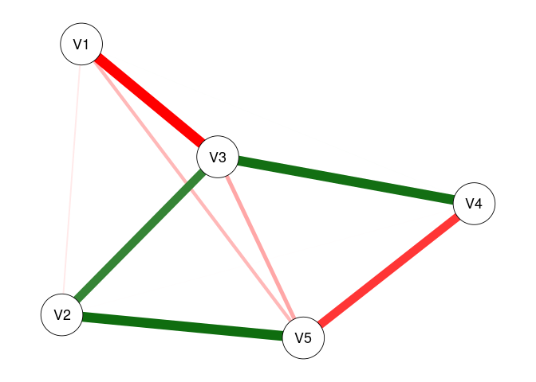

``` r
plot(fit1)
```

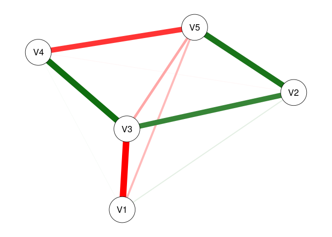

``` r
plot(fit2)
```

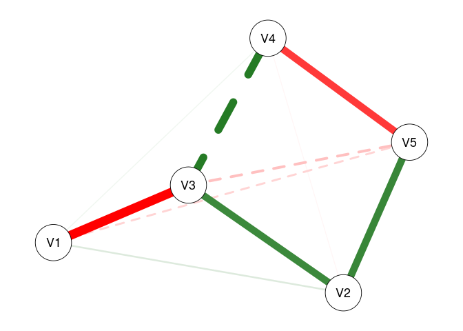

``` r
# We can plot each of these models to see the resultant undirected network

plot(fit0, threshold = .05)
```

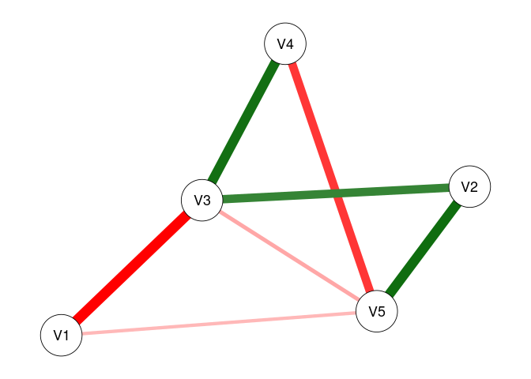

``` r
plot(fit1, threshold = .05)
```

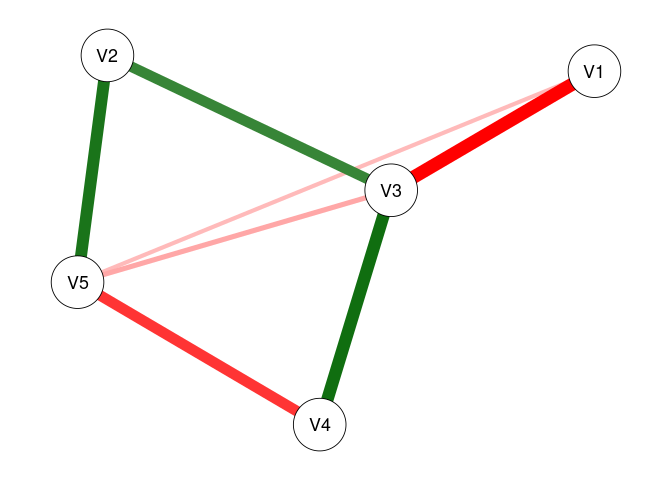

``` r
plot(fit2, threshold = .05)
```

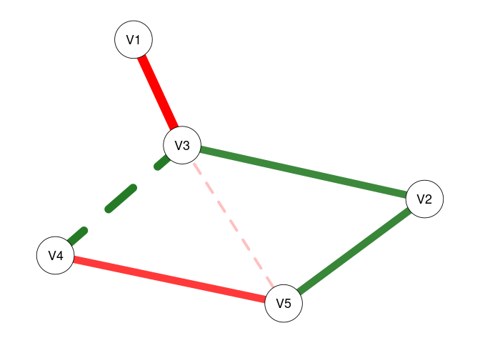

``` r
# Plot only significant edges (p < threshold) of the network.

plot(fit0, threshold = TRUE, predict = TRUE)
```

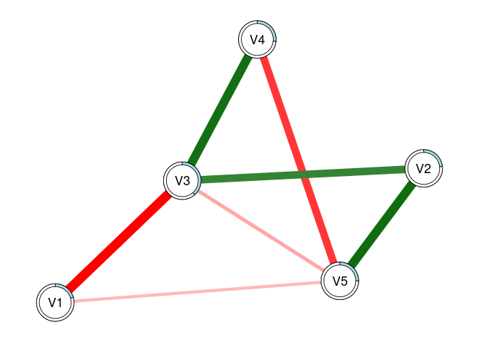

``` r
plot(fit1, threshold = TRUE, predict = 'R2')
```

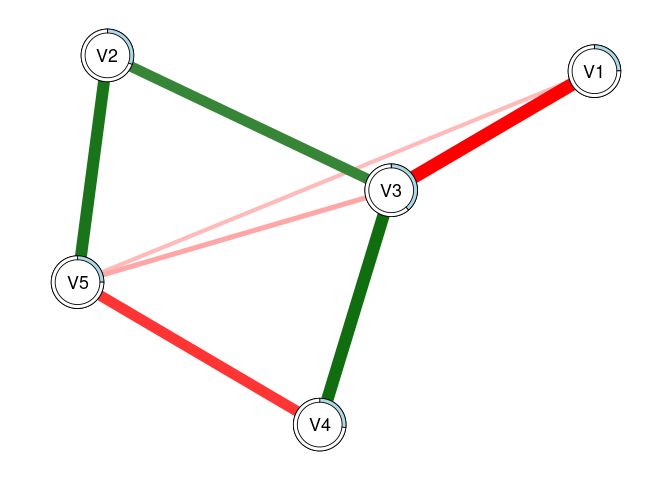

``` r
plot(fit2, threshold = TRUE, predict = 'adjR2')
```

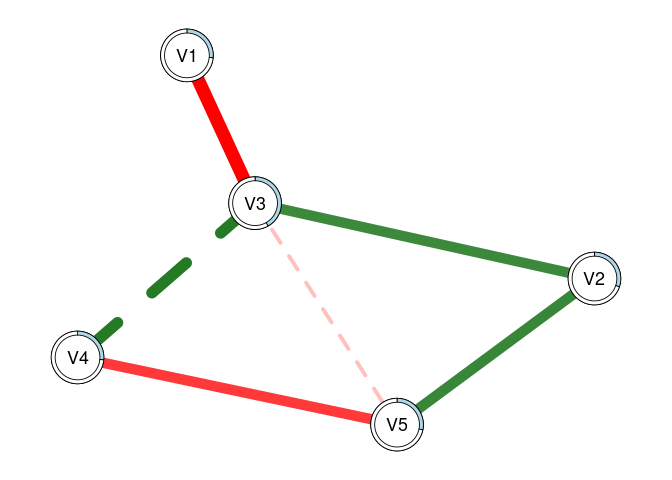

``` r
# Using 'threshold = TRUE' is the same as 'threshold = .05'
# 'predict = TRUE' plots R2 values for each regression
# This can also be specified as a string, as shown

plot(fit2, threshold = TRUE, predict = fit0)
```


``` r
# This can also be used to visually compare networks
# Here, the light blue ring around each node shows
# the R2 for 'fit0', while the slightly darker piece 
# shows the increase in R2 that we see with 'fit2'

predictNet(fit2)
#>   Variable    R2 adjR2   MSE  RMSE
#> 1       V1 0.279 0.265 1.022 1.011
#> 2       V2 0.314 0.301 1.071 1.035
#> 3       V3 0.428 0.418 1.059 1.029
#> 4       V4 0.278 0.265 0.955 0.977
#> 5       V5 0.295 0.282 1.103 1.050
predictNet(fit2, fit0)
#>   Variable    R2 adjR2    MSE   RMSE
#> 1       V1 0.074 0.066 -0.092 -0.044
#> 2       V2 0.080 0.073 -0.112 -0.053
#> 3       V3 0.043 0.038 -0.069 -0.033
#> 4       V4 0.010 0.003 -0.003 -0.002
#> 5       V5 0.045 0.039 -0.059 -0.028
# We can extract these values using this function
# And can take the differences by supplying two networks
# Values for the second model are subtracted from those for the first

plot(fit2, mnet = TRUE)
```

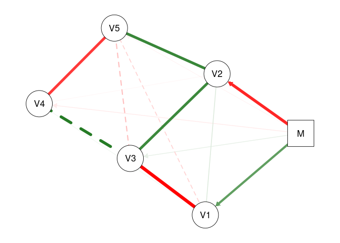

``` r
plot(fit2, threshold = TRUE, mnet = TRUE)
```

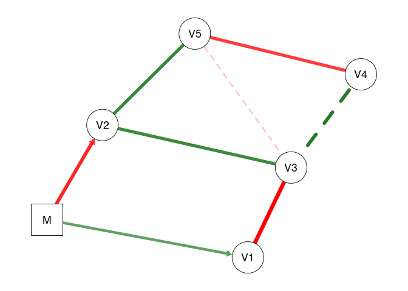

``` r
# 'mnet = TRUE' plots the exogenous moderator


### ============= VARIABLE SELECTION =============== ###
# These methods demonstrate the two-stage process for variable selection
# In the first stage, we use the data to select the active set of predictors
# In the second stage, we use those predictors to re-fit the models using OLS

### UNMODERATED NETWORKS
vars0 <- varSelect(data = dat0, criterion = 'BIC', method = 'glmnet')
#> =================================================================================================================================
vfit0 <- fitNetwork(data = dat0, type = vars0)
vfit1 <- fitNetwork(data = dat0, type = 'varSelect', criterion = 'BIC')
predictNet(vfit0, vfit1)
#>   Variable R2 adjR2 MSE RMSE
#> 1       V1  0     0   0    0
#> 2       V2  0     0   0    0
#> 3       V3  0     0   0    0
#> 4       V4  0     0   0    0
#> 5       V5  0     0   0    0
# In the first method, we use glmnet to perform variable selection for 
# each of the nodewise models. Then, we can subsequently include this in the
# 'fitNetwork' function. In the second approach, we can simply include everything
# in one command. We see that these produce the exact same models

vfit2 <- fitNetwork(data = dat0, type = 'varSelect', criterion = 'BIC', method = 'subset')
# We can also use best-subsets selection instead of the LASSO

predictNet(vfit2, vfit1)
#>   Variable     R2  adjR2    MSE   RMSE
#> 1       V1 -0.001  0.001 -0.001  0.000
#> 2       V2 -0.001  0.001 -0.002 -0.001
#> 3       V3  0.000  0.000  0.000  0.000
#> 4       V4  0.000  0.000  0.000  0.000
#> 5       V5 -0.017 -0.013  0.020  0.009
# In this case, we see that best-subsets produced lower R2 for three nodes

vfit3 <- fitNetwork(data = dat0, type = 'varSelect', criterion = 'CV', seed = 1)
vfit3.1 <- fitNetwork(data = dat0, type = 'varSelect', criterion = 'CV', seed = 1)
vfit3.2 <- fitNetwork(data = dat0, type = 'varSelect', criterion = 'CV', seed = 99)
# We can also use cross-validation with glmnet (but not best-subsets)

predictNet(vfit3, vfit3.1)
#>   Variable R2 adjR2 MSE RMSE
#> 1       V1  0     0   0    0
#> 2       V2  0     0   0    0
#> 3       V3  0     0   0    0
#> 4       V4  0     0   0    0
#> 5       V5  0     0   0    0
predictNet(vfit3, vfit3.2)
#>   Variable R2 adjR2 MSE RMSE
#> 1       V1  0     0   0    0
#> 2       V2  0     0   0    0
#> 3       V3  0     0   0    0
#> 4       V4  0     0   0    0
#> 5       V5  0     0   0    0
# We see that setting a seed leads to reproducible results


### MODERATED NETWORKS
vars1 <- varSelect(data = dat1, m = 6, criterion = 'BIC', method = 'glinternet')
#> Fitting model 1/5...  Complete! (0.13 secs)
#> Fitting model 2/5...  Complete! (0.11 secs)
#> Fitting model 3/5...  Complete! (0.08 secs)
#> Fitting model 4/5...  Complete! (0.07 secs)
#> Fitting model 5/5...  Complete! (0.07 secs)
#> ####### Total time: 0.46 secs
mfit1 <- fitNetwork(data = dat1, moderators = 6, type = vars1)
mfit2 <- fitNetwork(data = dat1, moderators = 6, type = 'varSelect', criterion = 'BIC')
predictNet(mfit1, mfit2)
#>   Variable R2 adjR2 MSE RMSE
#> 1       V1  0     0   0    0
#> 2       V2  0     0   0    0
#> 3       V3  0     0   0    0
#> 4       V4  0     0   0    0
#> 5       V5  0     0   0    0
# Again, we see that both methods produce the same model
# Creating the 'vars1' object separately can be useful when we wish
# to analyze the results from the variable selection process; plot outputs, obtain coefficients, etc.
# Also, all moderated networks use 'glinternet' as the selection method, and so it does not need to be specified

mfit2 <- fitNetwork(data = dat1, moderators = 6, type = 'varSelect', criterion = 'CV', seed = 1)
# We can use cross-validation with the glinternet algorithm as well


### ============== MODEL COMPARISON ================ ###
# Create a list of models we want to compare
fits <- list(fit0 = fit0, fit1 = fit1, fit2 = fit2, 
             vfit1 = vfit1, vfit2 = vfit2, vfit3 = vfit3,
             mfit1 = mfit1, mfit2 = mfit2)

modTable(fits)
#> $LRT
#>     net0  net1    Chisq Df   pval decision
#> 1   fit0  fit1  48.7152  5 0.0000     fit1
#> 2   fit0  fit2 147.1725 25 0.0000     fit2
#> 3  vfit1  fit0   0.0178  4 1.0000    vfit1
#> 4  vfit2  fit0  22.7036  8 0.0038     fit0
#> 5  vfit3  fit0   0.0178  4 1.0000    vfit3
#> 6   fit0 mfit1 121.7265  4 0.0000    mfit1
#> 7   fit0 mfit2 140.1842 12 0.0000    mfit2
#> 8   fit1  fit2  98.4573 20 0.0000     fit2
#> 9  vfit1  fit1  48.7330  9 0.0000     fit1
#> 10 vfit2  fit1  71.4188 13 0.0000     fit1
#> 11 vfit3  fit1  48.7330  9 0.0000     fit1
#> 12 mfit1  fit1  73.0112  1 0.0000    mfit1
#> 13  fit1 mfit2  91.4690  7 0.0000    mfit2
#> 14 vfit1  fit2 147.1903 29 0.0000     fit2
#> 15 vfit2  fit2 169.8762 33 0.0000     fit2
#> 16 vfit3  fit2 147.1903 29 0.0000     fit2
#> 17 mfit1  fit2  25.4461 21 0.2284    mfit1
#> 18 mfit2  fit2   6.9883 13 0.9028    mfit2
#> 19 vfit2 vfit1  22.6858  4 0.0001    vfit1
#> 20 vfit1 vfit3   0.0000  0 1.0000       - 
#> 21 vfit1 mfit1 121.7443  8 0.0000    mfit1
#> 22 vfit1 mfit2 140.2020 16 0.0000    mfit2
#> 23 vfit2 vfit3  22.6858  4 0.0001    vfit3
#> 24 vfit2 mfit1 144.4301 12 0.0000    mfit1
#> 25 vfit2 mfit2 162.8878 20 0.0000    mfit2
#> 26 vfit3 mfit1 121.7443  8 0.0000    mfit1
#> 27 vfit3 mfit2 140.2020 16 0.0000    mfit2
#> 28 mfit1 mfit2  18.4577  8 0.0180    mfit2
#> 
#> $omnibus
#>              LL df      AIC      BIC LRT
#> mfit2 -3400.600 38 6877.199 7098.513   7
#> mfit1 -3409.829 30 6879.657 7054.379   6
#> fit2  -3397.106 51 6896.211 7193.237   5
#> fit1  -3446.334 31 6954.668 7135.214   4
#> vfit1 -3470.701 22 6985.401 7113.530   2
#> vfit3 -3470.701 22 6985.401 7113.530   2
#> fit0  -3470.692 26 6993.384 7144.809   1
#> vfit2 -3482.044 18 7000.087 7104.920   0
#> 
#> attr(,"alpha")
#> [1] 0.05
# Performs likelihood ratio tests comparing each model with every other

modTable(fits)$omnibus
#>              LL df      AIC      BIC LRT
#> mfit2 -3400.600 38 6877.199 7098.513   7
#> mfit1 -3409.829 30 6879.657 7054.379   6
#> fit2  -3397.106 51 6896.211 7193.237   5
#> fit1  -3446.334 31 6954.668 7135.214   4
#> vfit1 -3470.701 22 6985.401 7113.530   2
#> vfit3 -3470.701 22 6985.401 7113.530   2
#> fit0  -3470.692 26 6993.384 7144.809   1
#> vfit2 -3482.044 18 7000.087 7104.920   0
# This shows us the final results. The 'LRT' column indicates
# the total number of times each model was selected across all tests
# We can see that 'fit2' (the saturated MNM) was selected across all tests
# The second-most selected was 'mfit2', which used glinternet with CV selection

modTable(fits, nodes = TRUE)
#> $nodes
#> $nodes$V1
#>              LL  df      AIC      BIC
#> fit0  -733.9535 495 1479.907 1505.195
#> fit1  -720.1321 494 1454.264 1483.767
#> fit2  -709.7404 490 1441.481 1487.841
#> vfit1 -733.9565 496 1477.913 1498.986
#> vfit2 -734.2404 497 1476.481 1493.339
#> vfit3 -733.9565 496 1477.913 1498.986
#> mfit1 -710.8920 494 1435.784 1465.286
#> mfit2 -710.8920 494 1435.784 1465.286
#> 
#> $nodes$V2
#>              LL  df      AIC      BIC
#> fit0  -748.9500 495 1509.900 1535.188
#> fit1  -724.3260 494 1462.652 1492.154
#> fit2  -721.4508 490 1464.902 1511.262
#> vfit1 -748.9514 496 1507.903 1528.976
#> vfit2 -749.2353 497 1506.471 1523.329
#> vfit3 -748.9514 496 1507.903 1528.976
#> mfit1 -724.7573 496 1459.515 1480.588
#> mfit2 -721.8251 493 1459.650 1493.367
#> 
#> $nodes$V3
#>              LL  df      AIC      BIC
#> fit0  -737.0920 495 1486.184 1511.472
#> fit1  -736.8972 494 1487.794 1517.297
#> fit2  -718.8669 490 1459.734 1506.094
#> vfit1 -737.0920 495 1486.184 1511.472
#> vfit2 -737.0920 495 1486.184 1511.472
#> vfit3 -737.0920 495 1486.184 1511.472
#> mfit1 -720.3461 492 1458.692 1496.624
#> mfit2 -718.8669 490 1459.734 1506.094
#> 
#> $nodes$V4
#>              LL  df      AIC      BIC
#> fit0  -696.3325 495 1404.665 1429.953
#> fit1  -696.0762 494 1406.152 1435.655
#> fit2  -692.7979 490 1407.596 1453.957
#> vfit1 -696.3371 497 1400.674 1417.533
#> vfit2 -696.3371 497 1400.674 1417.533
#> vfit3 -696.3371 497 1400.674 1417.533
#> mfit1 -696.3371 497 1400.674 1417.533
#> mfit2 -693.5546 495 1399.109 1424.397
#> 
#> $nodes$V5
#>              LL  df      AIC      BIC
#> fit0  -744.4335 495 1500.867 1526.155
#> fit1  -744.4163 494 1502.833 1532.335
#> fit2  -728.9414 490 1479.883 1526.244
#> vfit1 -744.4335 495 1500.867 1526.155
#> vfit2 -749.8211 497 1507.642 1524.501
#> vfit3 -744.4335 495 1500.867 1526.155
#> mfit1 -729.0802 492 1476.160 1514.092
#> mfit2 -728.9428 491 1477.886 1520.032
#> 
#> 
#> $LRT
#> $LRT$LL_diff2
#>     net0  net1 |           V1           V2         V3          V4           V5
#> 1   fit0  fit1 | 27.642732993 49.248007033  0.3895996 0.512704268  0.034506600
#> 2   fit0  fit2 | 48.426212747 54.998357118 36.4501942 7.069194569 30.984132425
#> 3  vfit1  fit0 |  0.005980198  0.002913092  0.0000000 0.009184894  0.000000000
#> 4  vfit2  fit0 |  0.573754166  0.570687060  0.0000000 0.009184894 10.775144944
#> 5  vfit3  fit0 |  0.005980198  0.002913092  0.0000000 0.009184894  0.000000000
#> 6   fit0 mfit1 | 46.122928240 48.385466247 33.4917773 0.009184894 30.706638845
#> 7   fit0 mfit2 | 46.122928240 54.249832678 36.4501942 5.555794961 30.981365617
#> 8   fit1  fit2 | 20.783479754  5.750350084 36.0605946 6.556490301 30.949625826
#> 9  vfit1  fit1 | 27.648713191 49.250920125  0.3895996 0.521889162  0.034506600
#> 10 vfit2  fit1 | 28.216487159 49.818694093  0.3895996 0.521889162 10.809651544
#> 11 vfit3  fit1 | 27.648713191 49.250920125  0.3895996 0.521889162  0.034506600
#> 12 mfit1  fit1 | 18.480195247  0.862540787 33.1021777 0.521889162 30.672132246
#> 13  fit1 mfit2 | 18.480195247  5.001825644 36.0605946 5.043090693 30.946859017
#> 14 vfit1  fit2 | 48.432192945 55.001270210 36.4501942 7.078379463 30.984132425
#> 15 vfit2  fit2 | 48.999966913 55.569044177 36.4501942 7.078379463 41.759277369
#> 16 vfit3  fit2 | 48.432192945 55.001270210 36.4501942 7.078379463 30.984132425
#> 17 mfit1  fit2 |  2.303284507  6.612890871  2.9584169 7.078379463  0.277493580
#> 18 mfit2  fit2 |  2.303284507  0.748524440  0.0000000 1.513399608  0.002766809
#> 19 vfit2 vfit1 |  0.567773968  0.567773968  0.0000000 0.000000000 10.775144944
#> 20 vfit1 vfit3 |  0.000000000  0.000000000  0.0000000 0.000000000  0.000000000
#> 21 vfit1 mfit1 | 46.128908438 48.388379339 33.4917773 0.000000000 30.706638845
#> 22 vfit1 mfit2 | 46.128908438 54.252745770 36.4501942 5.564979855 30.981365617
#> 23 vfit2 vfit3 |  0.567773968  0.567773968  0.0000000 0.000000000 10.775144944
#> 24 vfit2 mfit1 | 46.696682406 48.956153307 33.4917773 0.000000000 41.481783789
#> 25 vfit2 mfit2 | 46.696682406 54.820519737 36.4501942 5.564979855 41.756510561
#> 26 vfit3 mfit1 | 46.128908438 48.388379339 33.4917773 0.000000000 30.706638845
#> 27 vfit3 mfit2 | 46.128908438 54.252745770 36.4501942 5.564979855 30.981365617
#> 28 mfit1 mfit2 |  0.000000000  5.864366431  2.9584169 5.564979855  0.274726771
#> 
#> $LRT$Df_diff
#>     net0  net1 | V1 V2 V3 V4 V5
#> 1   fit0  fit1 |  1  1  1  1  1
#> 2   fit0  fit2 |  5  5  5  5  5
#> 3  vfit1  fit0 |  1  1  0  2  0
#> 4  vfit2  fit0 |  2  2  0  2  2
#> 5  vfit3  fit0 |  1  1  0  2  0
#> 6   fit0 mfit1 |  1  1  3  2  3
#> 7   fit0 mfit2 |  1  2  5  0  4
#> 8   fit1  fit2 |  4  4  4  4  4
#> 9  vfit1  fit1 |  2  2  1  3  1
#> 10 vfit2  fit1 |  3  3  1  3  3
#> 11 vfit3  fit1 |  2  2  1  3  1
#> 12 mfit1  fit1 |  0  2  2  3  2
#> 13  fit1 mfit2 |  0  1  4  1  3
#> 14 vfit1  fit2 |  6  6  5  7  5
#> 15 vfit2  fit2 |  7  7  5  7  7
#> 16 vfit3  fit2 |  6  6  5  7  5
#> 17 mfit1  fit2 |  4  6  2  7  2
#> 18 mfit2  fit2 |  4  3  0  5  1
#> 19 vfit2 vfit1 |  1  1  0  0  2
#> 20 vfit1 vfit3 |  0  0  0  0  0
#> 21 vfit1 mfit1 |  2  0  3  0  3
#> 22 vfit1 mfit2 |  2  3  5  2  4
#> 23 vfit2 vfit3 |  1  1  0  0  2
#> 24 vfit2 mfit1 |  3  1  3  0  5
#> 25 vfit2 mfit2 |  3  4  5  2  6
#> 26 vfit3 mfit1 |  2  0  3  0  3
#> 27 vfit3 mfit2 |  2  3  5  2  4
#> 28 mfit1 mfit2 |  0  3  2  2  1
#> 
#> $LRT$pval
#>     net0  net1 |     V1     V2     V3     V4     V5
#> 1   fit0  fit1 | 0.0000 0.0000 0.5325 0.4740 0.8526
#> 2   fit0  fit2 | 0.0000 0.0000 0.0000 0.2155 0.0000
#> 3  vfit1  fit0 | 0.9384 0.9570 1.0000 0.9954 1.0000
#> 4  vfit2  fit0 | 0.7506 0.7518 1.0000 0.9954 0.0046
#> 5  vfit3  fit0 | 0.9384 0.9570 1.0000 0.9954 1.0000
#> 6   fit0 mfit1 | 0.0000 0.0000 0.0000 0.9954 0.0000
#> 7   fit0 mfit2 | 0.0000 0.0000 0.0000 0.0000 0.0000
#> 8   fit1  fit2 | 0.0003 0.2186 0.0000 0.1613 0.0000
#> 9  vfit1  fit1 | 0.0000 0.0000 0.5325 0.9141 0.8526
#> 10 vfit2  fit1 | 0.0000 0.0000 0.5325 0.9141 0.0128
#> 11 vfit3  fit1 | 0.0000 0.0000 0.5325 0.9141 0.8526
#> 12 mfit1  fit1 | 0.0000 0.6497 0.0000 0.9141 0.0000
#> 13  fit1 mfit2 | 0.0000 0.0253 0.0000 0.0247 0.0000
#> 14 vfit1  fit2 | 0.0000 0.0000 0.0000 0.4208 0.0000
#> 15 vfit2  fit2 | 0.0000 0.0000 0.0000 0.4208 0.0000
#> 16 vfit3  fit2 | 0.0000 0.0000 0.0000 0.4208 0.0000
#> 17 mfit1  fit2 | 0.6802 0.3581 0.2278 0.4208 0.8704
#> 18 mfit2  fit2 | 0.6802 0.8617 1.0000 0.9115 0.9581
#> 19 vfit2 vfit1 | 0.4511 0.4511 1.0000 1.0000 0.0046
#> 20 vfit1 vfit3 | 1.0000 1.0000 1.0000 1.0000 1.0000
#> 21 vfit1 mfit1 | 0.0000 0.0000 0.0000 1.0000 0.0000
#> 22 vfit1 mfit2 | 0.0000 0.0000 0.0000 0.0619 0.0000
#> 23 vfit2 vfit3 | 0.4511 0.4511 1.0000 1.0000 0.0046
#> 24 vfit2 mfit1 | 0.0000 0.0000 0.0000 1.0000 0.0000
#> 25 vfit2 mfit2 | 0.0000 0.0000 0.0000 0.0619 0.0000
#> 26 vfit3 mfit1 | 0.0000 0.0000 0.0000 1.0000 0.0000
#> 27 vfit3 mfit2 | 0.0000 0.0000 0.0000 0.0619 0.0000
#> 28 mfit1 mfit2 | 1.0000 0.1184 0.2278 0.0619 0.6002
#> 
#> $LRT$decision
#>     net0  net1 |    V1    V2    V3    V4    V5
#> 1   fit0  fit1 |  fit1  fit1  fit0  fit0  fit0
#> 2   fit0  fit2 |  fit2  fit2  fit2  fit0  fit2
#> 3  vfit1  fit0 | vfit1 vfit1    -  vfit1    - 
#> 4  vfit2  fit0 | vfit2 vfit2    -  vfit2  fit0
#> 5  vfit3  fit0 | vfit3 vfit3    -  vfit3    - 
#> 6   fit0 mfit1 | mfit1 mfit1 mfit1 mfit1 mfit1
#> 7   fit0 mfit2 | mfit2 mfit2 mfit2 mfit2 mfit2
#> 8   fit1  fit2 |  fit2  fit1  fit2  fit1  fit2
#> 9  vfit1  fit1 |  fit1  fit1 vfit1 vfit1 vfit1
#> 10 vfit2  fit1 |  fit1  fit1 vfit2 vfit2  fit1
#> 11 vfit3  fit1 |  fit1  fit1 vfit3 vfit3 vfit3
#> 12 mfit1  fit1 | mfit1 mfit1 mfit1 mfit1 mfit1
#> 13  fit1 mfit2 | mfit2 mfit2 mfit2 mfit2 mfit2
#> 14 vfit1  fit2 |  fit2  fit2  fit2 vfit1  fit2
#> 15 vfit2  fit2 |  fit2  fit2  fit2 vfit2  fit2
#> 16 vfit3  fit2 |  fit2  fit2  fit2 vfit3  fit2
#> 17 mfit1  fit2 | mfit1 mfit1 mfit1 mfit1 mfit1
#> 18 mfit2  fit2 | mfit2 mfit2    -  mfit2 mfit2
#> 19 vfit2 vfit1 | vfit2 vfit2    -     -  vfit1
#> 20 vfit1 vfit3 |    -     -     -     -     - 
#> 21 vfit1 mfit1 | mfit1 mfit1 mfit1    -  mfit1
#> 22 vfit1 mfit2 | mfit2 mfit2 mfit2 vfit1 mfit2
#> 23 vfit2 vfit3 | vfit2 vfit2    -     -  vfit3
#> 24 vfit2 mfit1 | mfit1 mfit1 mfit1    -  mfit1
#> 25 vfit2 mfit2 | mfit2 mfit2 mfit2 vfit2 mfit2
#> 26 vfit3 mfit1 | mfit1 mfit1 mfit1    -  mfit1
#> 27 vfit3 mfit2 | mfit2 mfit2 mfit2 vfit3 mfit2
#> 28 mfit1 mfit2 |    -  mfit1 mfit1 mfit1 mfit1
#> 
#> 
#> $counts
#>       V1 V2 V3 V4 V5
#> fit0   0  0  1  2  2
#> fit1   4  5  0  1  1
#> fit2   5  4  5  0  5
#> vfit1  1  1  1  4  2
#> vfit2  3  3  1  4  0
#> vfit3  1  1  1  4  2
#> mfit1  6  7  7  4  7
#> mfit2  6  6  5  3  6
#> 
#> attr(,"alpha")
#> [1] 0.05
# This does the same thing as above but at the nodewise level
```

More examples to be added soon.

Please contact <trevorswanson222@gmail.com> with any questions.
